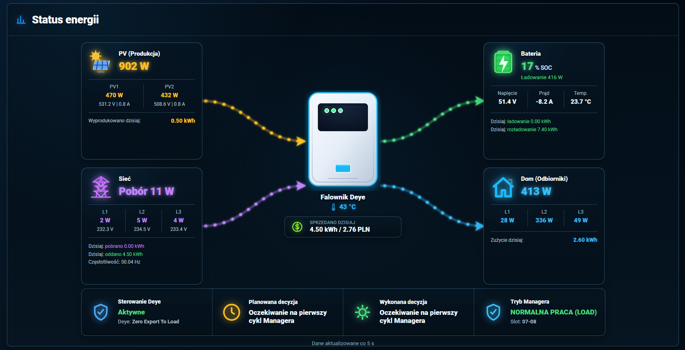
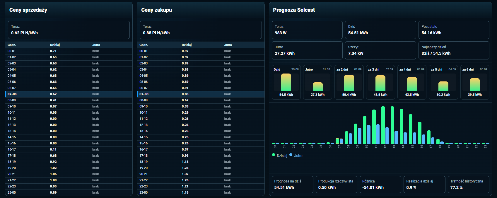
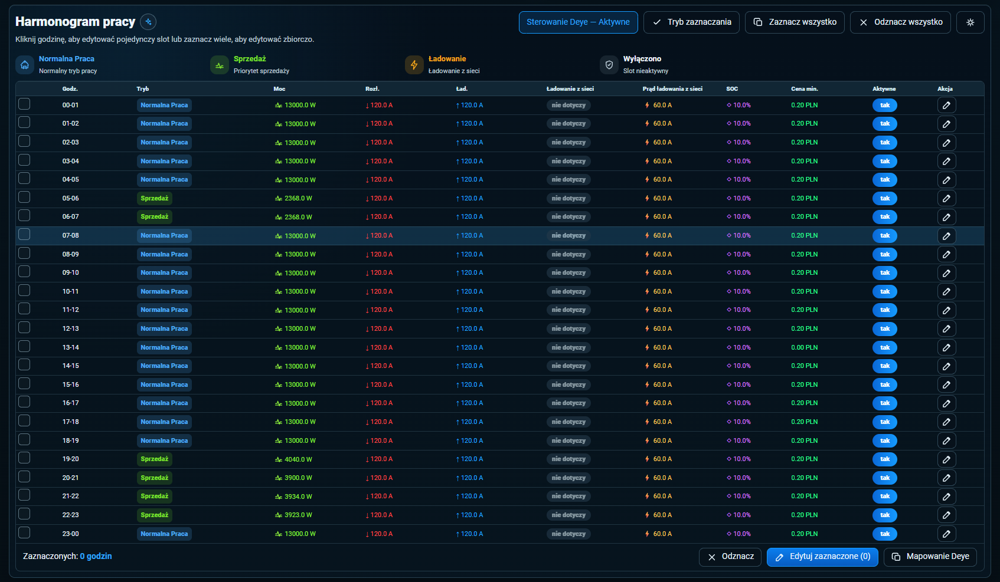
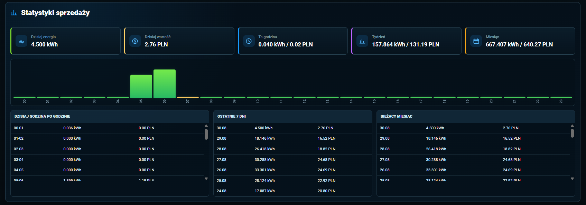
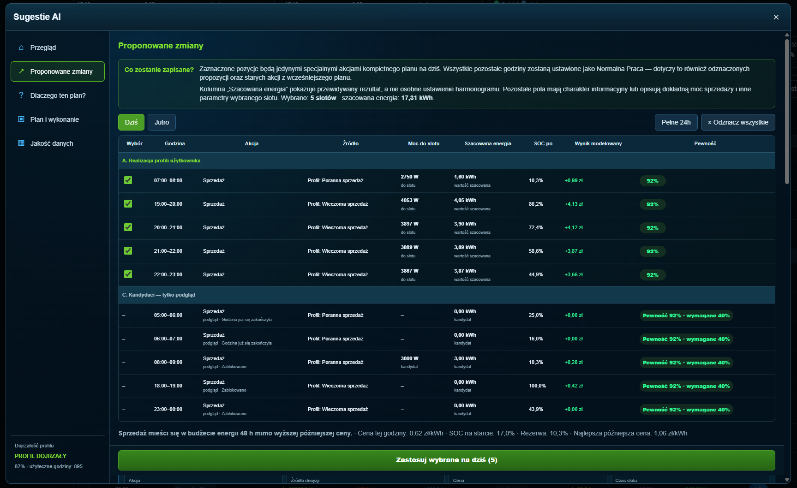
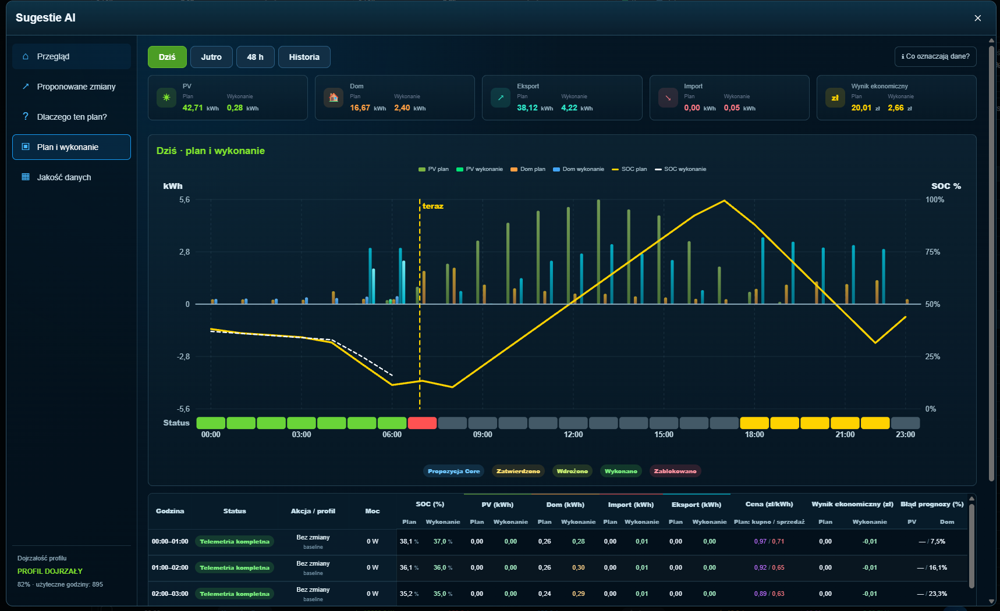

# Deye Energy Manager dla Home Assistant


[](#co-nowego-w-080)
[](#szybki-start)
[](LICENSE)
[](#wymagania)

Deye Energy Manager to niestandardowa integracja Home Assistant do planowania i
bezpiecznego sterowania falownikiem Deye. Łączy Harmonogram pracy, fizyczne Deye
Time Of Use, ceny energii, Solcast, statystyki, Optimizer Core i opcjonalne
Sugestie AI w jednej karcie Lovelace.

💛 **Darmowe i open-source.** Jeśli Deye Energy Manager pomaga Ci lepiej
sprzedawać energię, oszczędzać kWh albo wygodniej obsługiwać falownik Deye,
możesz [postawić kawę](https://buycoffee.to/pasierbrg) ☕. To najlepszy sygnał,
że warto rozwijać i utrzymywać ten projekt.

<a href="https://buycoffee.to/pasierbrg" target="_blank">
  
</a>

## Najważniejsze możliwości

- Harmonogram pracy obejmujący 24 jednogodzinne sloty;
- trzy logiczne tryby: **Normalna Praca**, **Ładowanie** i **Sprzedaż**;
- Mapowanie Deye z planu 24 h do sześciu fizycznych zakresów 6/6;
- edytor fizycznego Deye Time Of Use z odczytem actual/expected/status;
- nadrzędny przełącznik **Sterowanie Deye**;
- transakcyjne zapisy diff-only z confirmation i rollbackiem;
- automatyczne źródła cen Pstryk/PSE/RCE oraz katalog taryf sprzedawców i OSD;
- Optimizer Core, FuturePlan Dziś/Jutro i bezpieczne wykonanie JIT;
- spójna analiza Solcast z historią oraz opcjonalne, doradcze Sugestie AI;
- automatycznie zarządzany zasób Lovelace w standardowym trybie UI/storage;
- diagnostyka providerów, mapowania i jakości danych.

## Zrzuty ekranu — Deye Energy Manager 0.8.0

**Status energii** — bieżące przepływy PV, bateria, sieć, dom i decyzja Managera.



<table>
  <tr>
    <td width="50%">
      <strong>Ceny energii i Solcast</strong><br>
      <br>
      <sub>Ceny zakupu i sprzedaży oraz prognoza PV.</sub>
    </td>
    <td width="50%">
      <strong>Harmonogram pracy</strong><br>
      <br>
      <sub>Pełne 24 h z Normalną Pracą, Sprzedażą i Ładowaniem.</sub>
    </td>
  </tr>
  <tr>
    <td width="50%">
      <strong>Statystyki sprzedaży</strong><br>
      <br>
      <sub>Energia sprzedana i wynik w PLN.</sub>
    </td>
    <td width="50%">
      <strong>Sugestie AI — Proponowane zmiany</strong><br>
      <br>
      <sub>Propozycje Optimizer Core i wybór akcji.</sub>
    </td>
  </tr>
  <tr>
    <td colspan="2">
      <strong>Sugestie AI — Plan i wykonanie</strong><br>
      <br>
      <sub>Porównanie planu z wykonaniem oraz przebieg SOC.</sub>
    </td>
  </tr>
</table>

## Obsługiwane źródła Deye i providerzy

| Provider | Odczyty | Sterowanie | Deye Time Of Use |
|---|---:|---:|---:|
| ESPHome Deye Inverter — Lewa-Reka | tak | tak | pełne 6/6 |
| Solarman | po zmapowaniu | tak | pełne 6/6 |
| Sunsynk | po zmapowaniu | tak | pełne 6/6 |
| Mapowanie niestandardowe | częściowe lub pełne | zależnie od encji | częściowe lub pełne |
| Deye Inverter MQTT / Addon | po zmapowaniu | nie | tylko odczyt |

Referencyjnym źródłem encji jest
[ESPHome Deye Inverter — Lewa-Reka](https://github.com/Lewa-Reka/esphome-deye-inverter).
Obsługiwane są również encje publikowane przez
[Solarman](https://github.com/StephanJoubert/home_assistant_solarman),
[Sunsynk](https://github.com/kellerza/sunsynk) i odczytowy profil
[Deye Inverter MQTT](https://github.com/kbialek/deye-inverter-mqtt/tree/0fd4b4d6416f93118829fa7c133c1533bb6440f2).

Kreator ogranicza automatyczne wykrywanie do wybranego urządzenia falownika.
Mapowanie może być częściowe, ale niedostępne funkcje pozostają bezpiecznie
zablokowane. Profil read-only nie otrzymuje zastępczych surowych zapisów MQTT.

## Jak działa Harmonogram pracy

Harmonogram zawiera 24 sloty po jednej godzinie. Edycja pojedynczego slotu działa
na lokalnym szkicu: zmiana pola nie wywołuje usługi Home Assistant. **Anuluj**
odrzuca szkic, a **Zapisz** wysyła jeden logiczny patch zawierający wszystkie
rzeczywiście zmienione pola. Dialog czeka na potwierdzony stan backendu.

Zmiana trybu może skopiować do szkicu zapisany profil Normalnej Pracy albo
Ładowania. Późniejsze ręczne wartości slotu mają pierwszeństwo. Aktualizacja
stanów Home Assistant nie nadpisuje aktywnego szkicu.

## Tryby Managera

### Normalna Praca

To logiczny tryb Managera. Fizycznie provider używa odpowiedniego wariantu
pracy falownika, na przykład `Zero Export To Load` albo `Zero Export To CT`.
Wariant jest zapisany w slocie jako `physical_work_mode`; techniczne nazwy
providera nie są nazwami trybów użytkownika.

### Ładowanie

Slot przechowuje osobno:

- `charge_current` — prąd ładowania baterii;
- `grid_charge_current` — globalny limit prądu ładowania z sieci używany przy
  wykonywaniu aktywnego slotu;
- `charge_enabled` — fizyczną zgodę Grid Charge dla godzin objętych slotem;
- `tou_soc` — fizyczny SOC Deye TOU.

Sama dodatnia wartość prądu nie włącza Ładowania z sieci. Decyduje o tym jawne
`charge_enabled` zapisane w slocie.

### Sprzedaż

Slot Sprzedaży może określać moc sprzedaży, prąd rozładowania, minimalną cenę i
dwa niezależne poziomy SOC:

- `minimum_sell_soc` — **logiczny próg zatrzymania sprzedaży przez Managera**;
- `tou_soc` — **fizyczny SOC zapisywany do Deye Time Of Use**.

Osiągnięcie `minimum_sell_soc` wstrzymuje sprzedaż, ale nie zmienia fizycznego
SOC TOU. Brak lub błąd danych SOC/ceny blokuje wyłącznie aktywny slot Sprzedaży,
który wymaga danego warunku.

## Mapowanie Deye 24 h → 6/6

Przepływ danych jest jednoznaczny:

```text
Harmonogram pracy 24 h
→ oczekiwana mapa sześciu zakresów
→ Deye Time Of Use
→ confirmation/readback
→ rollback przy błędzie
```

Aktualne kryterium segmentacji fizycznej obejmuje wyłącznie parę:

- `tou_soc`;
- `charge_enabled` (Grid Charge).

Sąsiednie godziny o tej samej parze tworzą jeden zakres. Jeżeli zakresów jest
mniej niż sześć, najdłuższe są deterministycznie dzielone. Jeżeli plan wymaga
więcej niż sześciu różnych kolejnych zakresów, zapis zostaje zablokowany przed
pierwszą zmianą falownika. `minimum_sell_soc`, logiczny tryb, moc i prądy nie są
kryteriami fizycznej segmentacji TOU.

Każdy fizyczny zakres zawiera:

- **Od** — start zakresu;
- **Do** — start następnego fizycznego slotu;
- **SOC Deye TOU**;
- **Grid Charge / źródło ładowania**.

Globalne limity mocy i prądów nie są polami per-slot fizycznego TOU.

## Deye Time Of Use

Edytor pokazuje pola na podstawie capabilities zwróconych przez backend. Dzięki
temu pełny provider udostępnia 6/6, Custom może pokazać tylko zmapowane pola, a
provider read-only nie oferuje zapisu.

W aktualnym modelu ręczne granice są godzinowe (`HH:00`):

- **Do slotu N** jest fizycznie zapisywane jako **Od slotu N+1**;
- **Do slotu 6** jest zapisywane jako **Od slotu 1**.

Widok pokazuje wartości oczekiwane, rzeczywisty readback i status każdego pola.
Równoległy zapis jest blokowany. Po zapisie backend czeka na confirmation, a w
razie błędu przywraca tylko encje rzeczywiście zmienione w tej transakcji.

## Reverse sync

Ręczna zmiana TOU wykonana w Deye Energy Managerze przebiega następująco:

```text
zapis fizyczny → confirmation/readback → reverse sync → kontrola round-trip
```

Reverse sync aktualizuje wyłącznie `tou_soc`, `charge_enabled` i przypisanie
godzin do fizycznych zakresów. Nie zmienia `mode`, `enabled`,
`minimum_sell_soc`, mocy, prądów, ceny ani `physical_work_mode`.

Dowolne sześć ręcznych granic z identycznym SOC i Grid Charge w sąsiednich
zakresach może nie być odtwarzalne przez algorytm 24 h → 6/6. W takim przypadku
round-trip jest odrzucany, a zmiana fizyczna i lokalny Harmonogram są wycofywane.

## Zewnętrzne zmiany Deye TOU

Jeżeli fizyczne TOU zostanie zmienione poza Deye Energy Managerem, Manager nie
adoptuje tej zmiany automatycznie do Harmonogramu. Pełny readback 6/6 jest
porównywany z oczekiwaną mapą; stary cache nie wystarcza do uznania zgodności.

- przy aktywnym Sterowaniu Deye wykonywane jest diff-only reconciliation;
- przy wyłączonym sterowaniu różnica jest tylko raportowana;
- przy `emergency_stop` automatyczna korekta jest zablokowana;
- provider read-only pozostaje bez zapisów;
- `unknown`, `unavailable` i częściowy readback nie są uznawane za zgodność.

Po własnym potwierdzonym zapisie aktualizowana jest fizyczna sygnatura, dzięki
czemu kolejny tick nie tworzy pętli zapisów.

## Sterowanie Deye

Nadrzędny przełącznik ma trzy stany:

- **Aktywne** — fizyczne operacje mogą się rozpocząć;
- **Wyłączanie** — trwająca transakcja jest bezpiecznie kończona lub wycofywana;
- **Wyłączone** — nie są wykonywane żadne fizyczne zapisy do falownika.

Przy wyłączonym sterowaniu nadal działają monitoring, lokalny Harmonogram,
Mapowanie Deye, Solcast, AI, Optimizer Core i diagnostyka. Ponowne włączenie nie
wysyła ślepo całej mapy: kolejny cykl odczytuje fizyczne TOU i naprawia wyłącznie
rozbieżne pola.

## Bezpieczeństwo zapisu

- centralny guard obejmuje wszystkie fizyczne ścieżki zapisu;
- TOU używa diff-only, snapshotu i confirmation z timeoutem do 30 sekund;
- rollback obejmuje tylko encje zapisane przez bieżącą transakcję;
- podczas wyłączania Sterowania Deye nie są uruchamiane safe defaults;
- niepełny albo niedostępny readback działa fail-closed;
- provider read-only nie otrzymuje zgadywanych operacji zastępczych;
- AI nigdy samodzielnie nie wywołuje usług falownika.

Są to zabezpieczenia programowe i transakcyjne integracji. DEM nie zastępuje BMS,
zabezpieczeń falownika, limitów instalacji ani świadomej kontroli użytkownika.

## Optimizer Core i Sugestie AI

Optimizer Core lokalnie oblicza plan na podstawie cen, Solcast, SOC, profili,
limitów falownika i jakości danych. Uwzględnia wspólne budżety mocy, importu i
eksportu oraz oddzielnie ocenia kompletność planu dziś i jutro.

`target_energy_kwh` profilu jest celem dziennym: każdy aktywny lokalny dzień
ma własny target, fulfillment i shortfall. Stan energii baterii nie jest przy
tym resetowany o północy — symulacja SOC pozostaje ciągła przez 48 godzin.

Maksymalny prąd rozładowania jest wejściowym ograniczeniem fizycznym Core.
Automatyczna sprzedaż zmienia wyłącznie logiczny tryb i moc sprzedaży; nie
nadpisuje globalnego limitu prądu baterii. Wyliczony z mocy prąd jest wyłącznie
informacją diagnostyczną.

W profilach sprzedaży pole **Maksymalna moc profilu** jest twardym sufitem dla
danego celu. Core może użyć niższej mocy z powodu limitu globalnego, eksportu,
falownika, encji Max Sell Power, prądu i napięcia baterii albo bezpieczeństwa SOC;
utracona po takim ograniczeniu energia jest redystrybuowana do innych
kwalifikujących godzin, o ile pozostaje tam realna capacity.

Strategia `best_hours` używa ceny sprzedaży jako miary ekonomicznej. Wyraźnie
droższa godzina ma pierwszeństwo także wtedy, gdy występuje później w tym samym
profilu. Godziny, których ceny różnią się najwyżej o ustawienie **Różnica ceny
uznawana za zbliżoną** (domyślnie `0,05 PLN/kWh`), mogą zostać zgrupowane i
wyrównane bounded water-fill, aby obniżyć chwilowy peak mocy. Dynamiczne limity
SOC, baterii, falownika, eksportu, PV i obciążenia domu są zawsze nadrzędne.

W Sugestiach AI **Wynik całego slotu** oznacza pełny modelowany bilans przepływów
tej godziny, a nie zysk wywołany wyłącznie przez widoczną decyzję. Ostatni slot
może obejmować również wartość terminalną baterii. Różnica wyniku slotu względem
planu bazowego nie jest izolowanym marginalnym benefitem decyzji; wiarygodna
**Korzyść całego planu względem bazowego** jest prezentowana oddzielnie.

Ustawienie **Minimalna moc automatycznej sprzedaży** ma wartość domyślną
`1000 W` i nie ogranicza sterowania ręcznego. Preferowany plan automatyczny nie
tworzy zapisywalnego slotu poniżej tego minimum: Core najpierw próbuje
redystrybucji i wyrównania, a nierozdzieloną pozostałość pokazuje jako shortfall.
Profil wymagany może jawnie zejść do fizycznego minimum, jeżeli jest to potrzebne
do realizacji wymaganego celu.

Interfejs rozdziela cztery niezależne informacje: **Jakość danych**,
**Dojrzałość profilu**, **Pewność planu** i **Gotowość wykonania**. Dojrzałość
jest wyliczana z zapisanych, zwalidowanych godzin i pokrycia profili, więc restart
nie zeruje uczenia i nie wymusza oczekiwania na siedem nowych dni. Kandydat o
zbyt niskiej pewności pozostaje widoczny jako podgląd, ale nie można go zaznaczyć
ani zastosować.

Przycisk **Zastosuj wybrane na dziś** traktuje zaznaczone propozycje jako jedyne
specjalne akcje kompletnego dzisiejszego planu. Wszystkie pozostałe godziny,
łącznie z odznaczonymi propozycjami i starszymi akcjami Harmonogramu, są
ustawiane na **Normalną Pracę**. Plan na jutro pozostaje oddzielny.

Opcjonalny asystent AI może analizować dokładny plan i proponować ograniczoną
liczbę zmian. Kandydat jest ponownie symulowany przez lokalny Core i wymaga
świadomego zatwierdzenia użytkownika. Zewnętrzne AI nie ma bezpośredniego dostępu
do usług Home Assistant ani Deye. Wyłączenie Sterowania Deye blokuje wykonanie,
ale nie monitoring i analizę.

## FuturePlan Dziś/Jutro

Akcja **Zastosuj wybrane na dziś** zapisuje kompletną intencję na 24 godziny:
zaznaczone pozycje są jedynymi akcjami specjalnymi, a wszystkie pozostałe godziny
otrzymują Normalną Pracę. Zwykła usługa częściowej zmiany Harmonogramu nadal
pozostaje patchem i nie ma tej pełnodniowej semantyki.

Akceptacja planu **Jutro** zapisuje datowany target 24 h, ale nie zmienia dziś
Harmonogramu ani falownika. Następnego dnia backend materializuje JIT wyłącznie
aktualny slot. `approved` i `physical_pending` nie oznaczają wykonania — status
`confirmed` powstaje dopiero po bezpiecznym zapisie i zgodnym readbacku. Brak
wiarygodnego SOC, ceny albo kontraktu wykonania działa fail-closed; minione okno
otrzymuje `missed`, bez catch-up i bez powtórki kolejnego dnia. Późniejsza ręczna
zmiana albo Apply Today ma zawsze pierwszeństwo nad starszą intencją FuturePlan.

## Stabilność runtime

Manager reaguje tylko na dokładną listę skonfigurowanych wejść i nie traktuje
własnych sensorów wyjściowych jako powodu do ponownego obliczenia. Optimizer Core,
AI, learning i zapisy Store używają single-flight/coalescing, a cięższe obliczenia
są wykonywane poza główną pętlą Home Assistant. Publikacja wyników jest
deduplikowana, historia ograniczana i kompaktowana, start obliczeń czeka na gotowy
Home Assistant, a unload usuwa listenery i zadania integracji.

## Wymagania

- Home Assistant 2026.6 lub nowszy;
- falownik i encje wspierane przez wybrany provider;
- komplet wymaganych encji dla funkcji, które mają być używane;
- poprawnie skonfigurowany fizyczny limit mocy falownika;
- sześć pełnych zestawów TOU dla zapisu pełnego 6/6.

## Szybki start

1. Dodaj `https://github.com/pasierbrg/deye-energy-manager` jako niestandardowe
   repozytorium HACS i zainstaluj integrację.
2. Uruchom ponownie Home Assistant.
3. Dodaj integrację **Deye Energy Manager**.
4. Wybierz provider i urządzenie falownika, a następnie sprawdź mapowanie encji.
5. Ustaw maksymalną moc falownika i pozostaw Sterowanie Deye wyłączone na czas
   pierwszej kontroli.
6. W standardowym trybie UI/storage integracja automatycznie rejestruje i
   aktualizuje zasób karty. Nie kopiuj karty do `/config/www` i nie zmieniaj
   ręcznie parametru `?v=`. W trybie YAML dodaj ręcznie:

   ```text
   /deye_energy_manager/deye-energy-manager-card.js?v=0.8.0.44
   ```

7. Sprawdź diagnostykę, Harmonogram, Mapowanie Deye i fizyczne Deye Time Of Use,
   a dopiero potem wykonaj pierwszy kontrolowany zapis.

Pełna instrukcja instalacji i aktualizacji znajduje się w [INSTALL_PL.md](INSTALL_PL.md).

## Mapowanie źródeł cen

Jawnie wybrane encje BUY Today, BUY Tomorrow, SELL Today i SELL Tomorrow mają
zawsze pierwszeństwo. Manager nie podmienia ich na domyślne encje integracji i
nie skanuje innych sensorów. Stabilne powiązanie Entity Registry pozwala przeżyć
zmianę nazwy tej samej encji; brak lub niejednoznaczność działa fail-closed.

Pstryk AIO obsługuje realne atrybuty `today_prices` i `tomorrow_prices` z polami
`start`, `end`, `price`. Dostępne są też ograniczone, jawne schematy generic,
PSE/RCE oraz konfiguracja custom. Diagnostyka ustawień pokazuje rozpoznany
adapter, schemat, pokrycie i powód błędu dla każdego z czterech mapowań.

Każde z czterech pól może pozostać puste. Świadomie wyczyszczone mapowanie jest
zapisywane jako stan `unmapped` i nie zostanie ponownie zastąpione Pstryk, RCE
ani inną wartością domyślną po reloadzie, reconfigure lub restarcie. Wyjątek jest
wyłącznie jawny: gdy oba BUY są puste, użytkownik może wybrać sprzedawcę energii
w ekranie taryfy. Dla zweryfikowanej standardowej taryfy katalog tworzy 24+24
kanoniczne ceny BUY z ceny energii brutto i zmiennego OSD doliczonego raz. Brak
sprzedawcy, ważnej ceny lub jednoznacznego produktu nadal działa fail-closed.

Cztery mapowania są nadrzędnym źródłem prawdy. Selector providera z
wcześniejszych wersji jest zachowywany wyłącznie dla migracji i nie nadpisuje
mapowań ani adaptera. Po zmianie encji kontrakt automatycznie usuwa binding,
schema i semantykę poprzedniego źródła. Pstryk i RCE są rozpoznawane
automatycznie; zaawansowana ręczna konfiguracja pozostaje dostępna tylko dla
Custom/Inne. Katalog sprzedawcy jest niezależnym, świadomie wybieranym fallbackiem
tylko dla całkowicie pustego BUY i nie wpływa na SELL.
Standardowy ekran taryfy udostępnia do edycji wyłącznie operatora OSD i taryfę;
cztery mapowania są podsumowaniem konfiguracji z Options Flow, a szczegółowa
diagnostyka i polaryzacja pozostają w zwiniętych sekcjach.

## Solcast i bieżąca realizacja

Backend utrzymuje jeden kanoniczny zestaw danych bieżącego dnia: prognozę na dziś,
produkcję od lokalnej północy, pozostałą prognozę, realizację procentową, różnicę
energii, trafność historyczną oraz prognozę na jutro. Główna karta i widok historii
pokazują tę samą bieżącą realizację. Wynik może przekroczyć 100%; brak, zero albo
nieaktualna prognoza nie jest prezentowana jako fałszywe `0%`.

Optimizer Core otrzymuje prognozy energii w kWh i osobną trafność historyczną.
Nie używa bieżącego procentu realizacji jako sygnału decyzyjnego. Mechanizm
historii sam inicjalizuje brakujący tracking i bezpiecznie obsługuje rollover dnia.

## Co nowego w 0.8.0

Wersja 0.8.0 dodaje providerów Deye, bezpieczne fizyczne TOU 6/6 bez wymaganego
globalnego przełącznika TOU, rozdzielone znaczenia SOC, transakcyjny edytor
Harmonogramu, reverse sync, nadrzędne Sterowanie Deye oraz rozszerzony Optimizer
Core i opcjonalne Sugestie AI. Kanoniczna architektura cen rozdziela BUY i SELL,
obsługuje Pstryk, PSE/RCE i źródła custom oraz oferuje kontrolowany fallback
taryfy sprzedawcy z OSD doliczanym dokładnie raz.

FuturePlan rozróżnia zapis logiczny od wykonania fizycznego: status
`confirmed` pojawia się dopiero po udanym zapisie do falownika i readbacku.
Zmiana ręczna wykonana po akceptacji ma pierwszeństwo. Datowane akcje nie są
wykonywane po czasie ani powtarzane następnego dnia.

Powody decyzji Core są prezentowane po polsku. Finalne poprawki stabilności
obejmują bezpieczne autodiscovery, semantykę nieustawionego `0 A` w slocie,
ścisłe rozróżnienie braku danych od prawdziwego zera, poprawki skalowania karty
oraz opcjonalne PV3/string/SOH bez przypadkowego mapowania.

W UI/storage zasób Lovelace jest tworzony i aktualizowany automatycznie. Solcast
pokazuje tę samą bieżącą realizację w głównej karcie i historii, oddzielając ją
od trafności historycznej. Wynik realizacji nie jest sztucznie ograniczany do
100% i nie jest wejściem decyzyjnym Optimizer Core.

Pełna historia zmian: [CHANGELOG.md](CHANGELOG.md).

Opis wydania: [RELEASE_NOTES_0.8.0.md](RELEASE_NOTES_0.8.0.md).

Zasady współtworzenia: [CONTRIBUTING.md](CONTRIBUTING.md).

## Testy

Repozytorium zawiera testy backendu, providerów, bezpieczeństwa transakcji,
Optimizer Core, AI i karty JavaScript. Przed zmianą produkcyjną uruchom pełny
pytest oraz wszystkie testy JS wskazane w [CONTRIBUTING.md](CONTRIBUTING.md).

### Kontrakt wykonania Optimizer Core

Core waliduje zakres i świeżość SOC, działa fail-closed przy krytycznym braku
danych oraz rozróżnia surową i efektywną pewność. Plan 48 h zachowuje ciągłość
SOC przez północ, porównuje wartość energii dziś i jutro oraz respektuje rezerwę
wariantu. Plan „Jutro” ponawia slot przy chwilowym braku danych, oznacza minione
okna jako `missed`, a gotowość do ręcznego potwierdzenia wyznacza na podstawie
realnych danych, kontraktu wykonania i zabezpieczeń zamiast licznika dni.
Po akceptacji „Jutro” backend zapisuje datowany, autorytatywny target 24 h:
zaznaczone pozycje są jedynymi akcjami specjalnymi, a każda pozostała godzina ma
intencję Normalna Praca. Akceptacja nie zmienia bieżącego harmonogramu ani
falownika; target jest materializowany dopiero następnego dnia JIT, tylko dla
aktualnego slotu.

### Kanoniczne źródła cen BUY i SELL

Manager przechowuje osobny kontrakt dla ceny zakupu i sprzedaży. Każdy kontrakt
opisuje adapter, encje Today/Tomorrow, jednostkę (`PLN/kWh` lub `PLN/MWh`),
podstawę brutto/netto, znaczenie ceny, mapowanie atrybutów i rozdzielczość.
Mapowania encji konfiguruje się wyłącznie w kroku **Encje cen energii**.
**Ustawienia i diagnostyka → Taryfa i dystrybucja** pokazują znane adaptery
diagnostycznie; edytowalne pola schematu są dostępne tylko dla Custom/Inne.

Pstryk BUY ma rolę `retail_buy_all_in`, a Pstryk SELL `prosumer_sell`. PSE/RCE
BUY ma rolę `energy_only`, natomiast RCE SELL jest `market_reference`, nie ceną
prosumencką zgadywaną automatycznie. PSE/RCE BUY jest ceną energii,
do której backend dodaje zmienną dystrybucję dokładnie raz; `rce_pln` jest
agregowane z kompletnych kwadransów według `period` i `business_date`. Bieżąca
cena prosumencka RCE SELL nie jest używana jako prognoza. Dla providerów generic
i custom nieznana jednostka, podstawa, semantyka albo brak jawnej roli
ekonomicznej blokuje planowanie do czasu uzupełnienia kontraktu.

Optimizer Core, diagnostyka i tabela cen korzystają z tych samych wierszy
backendu: `source_price_pln_kwh`, składniki dodane oraz
`final_price_pln_kwh`. Dzięki temu frontend nie zgaduje formatu providera i nie
dolicza OSD po raz drugi.

Stałe opłaty miesięczne nie są rozkładane na godziny: optymalizacja porównuje
wyłącznie marginalne składniki zmienne za kWh.

## Licencja

Projekt jest udostępniany na licencji [MIT](LICENSE).
