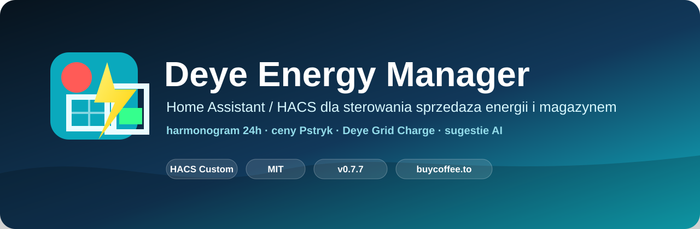

# Deye Energy Manager



[](#wersja-076)
[](#instalacja)
[](LICENSE)
[](#wymagania)

Deye Energy Manager jest niestandardową integracją Home Assistant dla falowników Deye. Łączy harmonogram sprzedaży, ochronę magazynu energii, ładowanie z sieci, ceny Pstryk, prognozę Solcast oraz statystyki w jednej karcie Lovelace.

## Wersja 0.7.6

Wersja 0.7.6 koncentruje się na bezpieczeństwie, jakości danych i wygodniejszej konfiguracji:

- brakujący albo nieprawidłowy odczyt SOC lub ceny jest błędem wyłącznie aktywnego slotu `Selling First`, gdy dany warunek jest dla niego ustawiony; prawidłowy odczyt poniżej progu jedynie wstrzymuje sprzedaż bez błędu harmonogramu, a sloty `Zero Export` działają bez tych danych;
- zapisy wielopolowe są serializowane; wartości liczbowe są zapisywane i potwierdzane przed ustawieniem wybranego trybu docelowego;
- harmonogram przekraczający 6 fizycznych zakresów Deye jest odrzucany przed aktywnym sterowaniem;
- karta stosuje operacje zbiorcze i sugestie przez jedną transakcyjną usługę backendu;
- dodano walidację trybów, mocy, prądów, SOC i cen;
- naprawiono działanie ochrony ceny oraz obsługę slotów ładowania;
- dodano edycję mapowania encji w opcjach integracji;
- sensory PV, domu i baterii można mapować bez zmiany kodu;
- bieżący dzień pokazuje realizację prognozy, a nie przedwczesną „trafność”;
- trafność historyczna korzysta wyłącznie z zakończonych dni, pokazuje liczbę próbek oraz ograniczoną korektę historyczną;
- dodano pomocniczą prognozę `weather.*` (domyślnie `weather.forecast_home_2`), która ocenia ryzyko pogodowe, ale nie zastępuje Solcast;
- próbki energii są zapisywane co 5 minut; surowe dane są przechowywane 90 dni, dane godzinowe 24 miesiące, dzienne 5 lat, a miesięczne bez automatycznego usuwania;
- dodano wersjonowany katalog taryf dystrybucyjnych PGE, Tauron, Enea, Energa i Stoen, obejmujący dostępne profile gospodarstw domowych oraz profil własny;
- katalog taryf jest sprawdzany przy starcie i co 7 dni; przy błędzie pobierania integracja zachowuje ostatnią poprawną kopię, a tryb ręczny pozwala wpisać własne stawki i godziny;
- koszt dystrybucji jest doliczany przy wyborze najtańszych godzin ładowania, z uwzględnieniem pory roku, dni roboczych, weekendów i polskich świąt;
- odczyty mocy, SOC i cen aktualizują sensory managera zdarzeniowo, bez oczekiwania na minutowy cykl sterownika;
- przebudowano „Sugestie AI” na widok Dziś/Jutro z interaktywnym planem energii 24/48 h, prognozą SOC, pogodą, oceną jakości danych i trzema rzeczywiście obliczanymi wariantami;
- plan na jutro jest zapisywany jako datowany plan oczekujący i nigdy nie jest natychmiast wpisywany do powtarzalnego harmonogramu Deye;
- kreator mapowania został podzielony na Deye, ceny energii, Solcast, pogodę oraz końcowy test; wybór operatora i taryfy znajduje się w karcie;
- automatyczne mapowanie wyłącznie podpowiada encje i zawsze wymaga zatwierdzenia użytkownika;
- poprawiono bezpieczeństwo HTML, widoki mobilne i przewijanie okien;
- dodano testy regresji najważniejszych reguł bezpieczeństwa.

Pełna lista znajduje się w [CHANGELOG.md](CHANGELOG.md).

## Najważniejsze funkcje

- 24 godzinne sloty sprzedaży i ładowania;
- tryby harmonogramu `Selling First`, `Normalna Praca` i `Charge`; w tle `Normalna Praca` nadal używa fizycznych trybów Deye `Zero Export To Load` lub `Zero Export To CT`;
- kompresja harmonogramu do 6 fizycznych slotów Deye Time Of Use;
- **Minimalny SOC sprzedaży** jest wyłącznie warunkiem biznesowym `Selling First`; nie jest zapisywany jako fizyczny SOC Deye Time Of Use;
- **Ładowanie z sieci: TAK** w konkretnym slocie `Charge` jest jedyną zgodą na ładowanie baterii z sieci; wartość **NIE** pozostawia Deye Grid Charge wyłączone;
- osobny profil **Ustawienia ładowania** jest zapisywany atomowo przez dedykowaną usługę backendu i zachowywany po ponownym otwarciu okna oraz restarcie Home Assistant; zapis nie wymaga obecności wszystkich encji pomocniczych. Stanowi szablon kopiowany przy wyborze trybu `Charge`: prąd ładowania, prąd rozładowania, prąd ładowania z sieci, zgoda na ładowanie z sieci i docelowy SOC. Późniejsze zmiany konkretnego slotu pozostają niezależne, a w edytorze slotu `Charge` dostępny jest przycisk ponownego wczytania szablonu;
- osobny profil **Ustawienia normalnej pracy** jest zapisywany atomowo przez dedykowaną usługę backendu i zachowywany po restarcie; stanowi szablon kopiowany przy wyborze trybu `Normalna Praca`: fizyczny tryb Deye (`Zero Export To Load` albo `Zero Export To CT`), moc sprzedaży, prąd rozładowania, prąd ładowania baterii, prąd ładowania z sieci i fizyczny SOC Deye TOU. Późniejsze zmiany konkretnego slotu pozostają niezależne, a w edytorze slotu dostępny jest przycisk ponownego wczytania szablonu. Formularz odczytuje dane w kolejności: szkic użytkownika, zapisanego profilu w `manager_status`, stanu encji; stara lub brakująca encja pomocnicza nie nadpisuje potwierdzonego profilu;
- pomocnicze encje profili (`charge_profile_*`, `normal_profile_*`) mogą być wyłączone w rejestrze encji; integracja nie zmienia automatycznie ich stanu `disabled_by`. Brak lub wyłączenie tych encji nie blokuje zapisu profili ani kopiowania szablonu Charge, ponieważ źródłem prawdy są usługi backendu i atrybuty `manager_status`;
- ręczne i zbiorcze edytowanie harmonogramu;
- inteligentne sugestie Dziś/Jutro bazujące na cenach energii i dystrybucji, Solcast, pogodzie, SOC i wyuczonym profilu zużycia;
- automatycznie aktualizowany katalog profili dystrybucyjnych PGE, Tauron, Enea, Energa i Stoen;
- wspomaganie prognozy przez lokalną encję pogodową;
- statystyki sprzedaży, produkcji, zużycia i pracy baterii;
- diagnostyka wymaganych encji;
- eksport historii i kopii konfiguracji.

Sugestie nie są stosowane automatycznie. Użytkownik wybiera godziny i zatwierdza każdą zmianę harmonogramu.

Okno **Sugestie AI** zawiera osobne widoki: **Przegląd**, **Proponowane zmiany**, **Plan na dziś**, **Plan na jutro**, **Plan energii 48h** i **Jakość danych**. W propozycjach przełącznik **Dziś/Jutro** zmienia tabelę, wykres, pogodę, bilans i prognozę SOC. Domyślnie widoczne są tylko godziny proponowane przez model; przycisk **Pełne 24h** pokazuje cały dzień, a jeden dynamiczny przycisk przełącza funkcję **Zaznacz wszystkie/Odznacz wszystkie**. Godziny o pewności poniżej 50% nie są zaznaczane automatycznie.

Plan 48 h nie tworzy brakujących cen ani pogody. Gdy brakuje cen jutra, karta pokazuje brak danych i nie proponuje fikcyjnej transakcji. Solcast jest prognozą podstawową, a `weather.*` wyłącznie korektą pomocniczą. Przy małej historii widoczny jest stan **Wstępne uczenie** i ograniczona pewność.

Wykresy **Plan na dziś**, **Plan na jutro** i **Plan energii 48h** rozdzielają produkcję rzeczywistą, prognozę Solcast, prognozę skorygowaną oraz jej przedział. Energia korzysta z lewej osi kWh, a SOC z prawej osi procentowej. Każda godzina ma własną ikonę pogody i wskaźnik ryzyka opadów, a osobne dolne pasy pokazują sprzedaż, ładowanie i tanią dystrybucję. Legenda pozwala ukrywać serie. Wariant 48 h ma zwiększoną szerokość, poziome przewijanie i wyraźny podział dni. Szczegóły godziny są dostępne po najechaniu kursorem lub dotknięciu wykresu. Brakujące pomiary są opisane jako brak danych, a nie zastępowane zerem.

Karta pogody korzysta z wybranej encji `weather.*` (domyślnie `weather.forecast_home_2`) oraz usługi Home Assistant `weather.get_forecasts`. Pokazuje warunki bieżące, temperaturę, ciśnienie, wilgotność i wiatr oraz przełączane prognozy dzienną i godzinową. Jeżeli dostawca nie udostępnia osobnej prognozy dziennej, integracja tworzy jej podsumowanie wyłącznie z dostępnych danych godzinowych.

Przycisk **Zaplanuj wybrane na jutro** zapisuje dokładnie zaakceptowane godziny i parametry wraz z datą. Integracja nie zmienia od razu Deye Time Of Use, ponieważ jego sloty powtarzają się codziennie. Po rozpoczęciu właściwego dnia sprawdzane są encje sterujące oraz tylko te warunki SOC i ceny, których wymaga zaakceptowany slot `Selling First`. Poprawny plan jest zastosowany jeden raz; plan nieaktualny lub niemożliwy do bezpiecznego zastosowania jest anulowany, a integracja stosuje pełne **Ustawienia domyślne** 1:1. Integracja nigdy nie przelicza i nie stosuje samodzielnie innego planu niż zatwierdzony przez użytkownika.

## Wymagania

Wymagany jest Home Assistant `2026.6` lub nowszy.

Podstawowe encje sterujące wymagane do pełnego działania integracji:

```text
select.deye_inverter_system_work_mode
number.deye_inverter_max_sell_power
number.deye_inverter_maximum_battery_discharge_current
number.deye_inverter_maximum_battery_charge_current
number.deye_inverter_maximum_battery_grid_charge_current
sensor.deye_inverter_battery
```

Powyższe encje muszą być dostępne, aby integracja mogła bezpiecznie sterować falownikiem. Brak odczytu SOC baterii blokuje sprzedaż z baterii w trybie `Selling First`, natomiast sloty `Zero Export` mogą nadal działać bez aktualnego SOC.

Cena sprzedaży jest wymagana wyłącznie dla aktywnego slotu `Selling First`, gdy ustawiono dla niego odpowiedni limit. Nie jest wymagana dla `Zero Export`.

Dla funkcji Deye Time Of Use wymagane są również:

```text
switch.deye_inverter_time_of_use
time.deye_inverter_time_of_use_1_start ... 6_start
number.deye_inverter_time_of_use_1_soc ... 6_soc
switch.deye_inverter_time_of_use_1_grid_charge ... 6_grid_charge
```

Opcjonalnie można skonfigurować sensory:

- mocy PV, domu, sieci i baterii;
- dziennej produkcji PV;
- cen sprzedaży i zakupu Pstryk;
- prognozy oraz aktualnej mocy Solcast.
- lokalnej prognozy godzinowej `weather.*`.

## Dane, trafność i uczenie

- **Realizacja dzisiaj** informuje, jaka część dzisiejszej prognozy została już wyprodukowana. Nie jest to ocena trafności.
- **Trafność historyczna** jest średnią z zamkniętych dni: `100% - bezwzględny błąd procentowy`.
- **Korekta historyczna** porównuje rzeczywistą produkcję z Solcast. Dla bezpieczeństwa pojedyncze współczynniki są ograniczone do zakresu `0,50–1,50`.
- Brakujące i niedostępne odczyty są oznaczane jako braki danych, a nie zapisywane jako sztuczne zera.
- Pogoda jest sygnałem pomocniczym. Solcast pozostaje głównym źródłem prognozy PV.

## Taryfy i dystrybucja

Operatora OSD, taryfę, źródło ceny oraz znaki przepływu ustawia się w karcie: **Ustawienia i diagnostyka → Taryfa i dystrybucja**. Zmiany zaczynają obowiązywać dopiero po użyciu przycisku **Zapisz ustawienia taryfy**. Kreator mapowania integracji służy wyłącznie do wyboru encji Home Assistant.

Tryb **Automatyczny katalog OSD** korzysta z wersjonowanego katalogu wbudowanego w integrację. Integracja sprawdza aktualizację przy starcie oraz co 7 dni, czyli kilka razy w miesiącu. Pobrane dane muszą przejść kontrolę schematu i stawek. Jeżeli serwer jest niedostępny albo plik jest nieprawidłowy, używana jest ostatnia poprawna kopia; brak kopii powoduje powrót do katalogu dostarczonego z wydaniem. Aktualizację można też uruchomić ręcznie przyciskiem **Sprawdź aktualizację katalogu**.

Zakładka pokazuje profil dystrybucji na 48 godzin — dziś i jutro — wraz ze strefą, rodzajem dnia, sezonem, stawką strefową, opłatami wspólnymi i łącznym kosztem dystrybucji. Profile obejmują sezonowe okna taryfowe, weekendy i polskie dni ustawowo wolne. AI porównuje pełny koszt zakupu dla każdej godziny dziś i jutro oraz zapisuje wyniki uczenia z oznaczeniem operatora, taryfy, strefy, rodzaju dnia, sezonu i wersji katalogu.

Jeżeli cena zakupu z wybranej encji zawiera już dystrybucję, należy włączyć opcję **Cena zakupu zawiera już dystrybucję**, aby koszt nie został doliczony drugi raz. Tryb **Ręczne stawki** pozwala wpisać własną stawkę szczytową, tanią i przedziały tanich godzin. W przypadku taryf dynamicznych wymagających osobnego sygnału integracja nie odgaduje cen ani stref i informuje o braku takiego sygnału.

Katalog jest pomocą do optymalizacji, ale przed uruchomieniem ładowania z sieci należy porównać operatora, taryfę i stawki z aktualną umową użytkownika.

Po instalacji mapowanie można zmienić przez **Ustawienia → Urządzenia i usługi → Deye Energy Manager → Konfiguruj**.

## Instalacja

### HACS

1. Otwórz HACS.
2. Dodaj repozytorium jako niestandardowe repozytorium typu **Integracja**.
3. Zainstaluj Deye Energy Manager.
4. Uruchom ponownie Home Assistant.
5. Dodaj integrację w **Ustawienia → Urządzenia i usługi**.

### Karta Lovelace

Integracja udostępnia kartę pod adresem:

```text
/deye_energy_manager/deye-energy-manager-card.js?v=23
```

Jeżeli karta jest instalowana ręcznie, skopiuj:

```text
www/deye-energy-manager-card.js
```

do `/config/www/` i dodaj zasób:

```text
/local/deye-energy-manager-card.js?v=23
```

Po podmianie pliku karty ustaw parametr `v=23`, przeładuj zasoby Lovelace i wykonaj twarde odświeżenie przeglądarki (`Ctrl + F5`). `23` jest aktualną rewizją karty wydania 0.7.6. Dla karty udostępnianej przez integrację używaj adresu `/deye_energy_manager/...`; adres `/local/...` jest przeznaczony wyłącznie dla pliku skopiowanego ręcznie do `/config/www/`.

Konfiguracja karty:

```yaml
type: custom:deye-energy-manager-card
```

Przykład kompletnego dashboardu znajduje się w `dashboard/energy_manager.yaml`.

### Konfiguracja układu (opcjonalna)

Wszystkie ustawienia są opcjonalne. Niepoprawne wartości są automatycznie zastępowane domyślnymi.

#### Tryby układu

| Tryb | Opis |
|------|------|
| `auto` | Pełny dashboard na komputerze. Na urządzeniach wąskich (poniżej `mobile.mobile_breakpoint`) aktywne są ustawienia mobilne; główny rząd **Ceny / Solcast** automatycznie składa się w jedną kolumnę zamiast trzech proporcjonalnych kolumn. Domyślny tryb. |
| `full` | Dashboard rozciąga się na pełną szerokość karty; kontener nie jest wyśrodkowywany. |
| `section` | Wyświetla tylko jedną sekcję główną wybraną w `section`. |
| `single` | Wyświetla tylko panel **Status energii** lub wybraną sekcję. Jeśli wybierzesz `ai` lub `settings`, otwiera się odpowiedni dialog. |
| `grid` | Sekcje główne (ceny, Solcast, harmonogram, statystyki) układane są w siatkę o liczbie kolumn określonej w `grid_columns`. Panel **Status energii** zachowuje pełną szerokość. |
| `fit` | Dashboard rozciąga się do szerokości karty, ale pozostaje wyśrodkowany w swoim maksymalnym rozmiarze. **Nie skaluje proporcjonalnie całego dashboardu** — dostosowuje tylko zewnętrzny kontener. |

```yaml
# Domyślny układ
type: custom:deye-energy-manager-card
layout:
  layout_mode: auto

# Tylko harmonogram, na przykład do osobnej karty/karty mobilnej
type: custom:deye-energy-manager-card
layout:
  layout_mode: single
  section: schedule

# Układ siatki 2 kolumny
type: custom:deye-energy-manager-card
layout:
  layout_mode: grid
  grid_columns: 2
  sections:
    status_energy: true
    prices: true
    solcast: true
    schedule: false
    sales_stats: false
```

#### Pełna tabela opcji konfiguracyjnych

| Nazwa | Typ | Domyślnie | Zakres / wartości | Opis |
|-------|-----|-----------|-------------------|------|
| `layout_mode` | string | `auto` | `auto`, `full`, `section`, `single`, `grid`, `fit` | Główny tryb układu dashboardu. |
| `dashboard_width` | number | `1280` | 320–2400 | Maksymalna szerokość wewnętrznego kontenera dashboardu w pikselach. |
| `center_dashboard` | boolean | `true` | `true` / `false` | Wyśrodkowanie dashboardu w karcie. |
| `fit_to_width` | boolean | `false` | `true` / `false` | Rozciągnięcie kontenera do pełnej szerokości karty. |
| `allow_horizontal_scroll` | boolean | `false` | `true` / `false` | Gdy `true`, główny kontener `.dem-v073` dostaje `overflow-x: auto`. Gdy `false`, główny kontener dostaje `overflow-x: hidden`, aby zapobiec globalnemu poziomemu przewijaniu strony. Lokalne przewijanie wewnątrz tabeli czy listy dni Solcast nie jest blokowane. |
| `grid_columns` | number | `null` | 1–6 | Liczba kolumn w trybie `grid`. `null` oznacza automatyczną jedną kolumnę. |
| `grid_gap` | number | `16` | 0–64 | Odstęp między kolumnami w trybie `grid`. |
| `section` | string | `null` | `status_energy`, `prices`, `solcast`, `schedule`, `sales_stats`, `ai`, `settings` | Sekcja do wyświetlenia w trybach `section` lub `single`. |
| `sections.status_energy` | boolean | `true` | `true` / `false` | Widoczność panelu **Status energii**. |
| `sections.prices` | boolean | `true` | `true` / `false` | Widoczność panelu **Ceny sprzedaży/zakupu**. |
| `sections.solcast` | boolean | `true` | `true` / `false` | Widoczność panelu **Prognoza Solcast**. |
| `sections.schedule` | boolean | `true` | `true` / `false` | Widoczność panelu **Harmonogram pracy**. |
| `sections.sales_stats` | boolean | `true` | `true` / `false` | Widoczność panelu **Statystyki sprzedaży**. |
| `mobile.mode` | string | `auto` | `auto`, `full`, `section`, `single`, `grid`, `fit` | Tryb układu stosowany na urządzeniach mobilnych. |
| `mobile.preserve_desktop_layout` | boolean | `false` | `true` / `false` | Jeśli `true`, mobilne urządzenie używa tego samego layoutu co desktop. |
| `mobile.fit_to_width` | boolean | `true` | `true` / `false` | Rozciągnięcie do szerokości ekranu na urządzeniach mobilnych. |
| `mobile.allow_horizontal_scroll` | boolean | `false` | `true` / `false` | Poziome przewijanie na urządzeniach mobilnych. |
| `mobile.grid_columns` | number | `1` | 1–4 | Liczba kolumn w trybie `grid` na urządzeniach mobilnych. |
| `mobile.mobile_breakpoint` | number | `768` | 320–1600 | Szerokość ekranu (px), poniżej której stosowane są ustawienia mobilne. |
| `prices_ratio` | number | `0.80` | 0.1–5.0 | Względna szerokość kolumny **Ceny sprzedaży** w górnym rzędzie informacyjnym **na desktopie**. Na mobilnym układzie sekcje składają się w jedną kolumnę, więc proporcje nie są stosowane. |
| `buy_prices_ratio` | number | `0.80` | 0.1–5.0 | Względna szerokość kolumny **Ceny zakupu** w górnym rzędzie informacyjnym **na desktopie**. Na mobilnym układzie sekcje składają się w jedną kolumnę, więc proporcje nie są stosowane. |
| `solcast_ratio` | number | `1.40` | 0.1–5.0 | Względna szerokość kolumny **Prognoza Solcast** w górnym rzędzie informacyjnym **na desktopie**. Na mobilnym układzie sekcje składają się w jedną kolumnę, więc proporcje nie są stosowane. |
| `energy_tile_width` | number | `300` | 120–360 | Szerokość bocznych kafli PV/sieć/bateria/dom w panelu **Status energii**. |
| `energy_tile_gap` | number | `28` | 0–100 | Odstęp między kaflem a inverterem w panelu **Status energii**. |
| `inverter_scale` | number | `1` | 0.5–2.0 | Skala centralnego invertera w panelu **Status energii**. |
| `flow_animation_speed` | number | `6` | 1–20 | Szybkość animacji przepływów (wyższa wartość = szybsza animacja). |
| `max_scale` | number | `1` | 0.2–3.0 | **Zarezerwowane.** Wczytywane przez `layoutConfig()`, ale obecnie nie wpływa na renderowanie. |
| `min_scale` | number | `0.2` | 0.1–1.0 | **Zarezerwowane.** Wczytywane przez `layoutConfig()`, ale obecnie nie wpływa na renderowanie. |

> **Uwagi do trybów i zarezerwowanych opcji**
> - `layout_mode: fit` nie wykonuje globalnego, proporcjonalnego skalowania całego dashboardu. Włącza tylko `fit_to_width` i `center_dashboard`, dzięki czemu kontener dashboardu dostosowuje się do szerokości karty, ale zachowuje swój wewnętrzny układ.
> - `max_scale` i `min_scale` są obecnie zarezerwowane. Wartości są walidowane i zapamiętywane, ale nie są używane przez `renderV073()` ani przez panel energii.

#### Przykłady

##### Domyślny układ
```yaml
type: custom:deye-energy-manager-card
```

##### Szeroki monitor (pełna szerokość)
```yaml
type: custom:deye-energy-manager-card
layout:
  layout_mode: full
  fit_to_width: true
```

##### Telefon (pojedyncza kolumna, brak przewijania poziomego)
```yaml
type: custom:deye-energy-manager-card
layout:
  layout_mode: auto
  allow_horizontal_scroll: false
  mobile:
    mode: grid
    preserve_desktop_layout: false
    grid_columns: 1
    fit_to_width: true
    allow_horizontal_scroll: false
    mobile_breakpoint: 768
```

Poniżej `mobile_breakpoint` karta porównuje szerokość viewportu i własnego hosta, a następnie przełącza się na konfigurację `mobile`. Przy `grid_columns: 1` sekcje **Ceny sprzedaży**, **Ceny zakupu** i **Solcast** są układane pionowo. Proporcje `prices_ratio`, `buy_prices_ratio` i `solcast_ratio` nadal sterują trzema kolumnami wyłącznie na desktopie.

Główny dashboard nie przewija się poziomo, gdy `allow_horizontal_scroll: false`. Szersza tabela Harmonogramu ma własny poziomy pasek przewijania, a lista dni Solcast przewija się lokalnie na wąskim ekranie. Wykres Solcast dopasowuje się do szerokości panelu i nie zwiększa szerokości całej karty.

##### Pojedyncza sekcja
```yaml
type: custom:deye-energy-manager-card
layout:
  layout_mode: single
  section: schedule
```

##### Układ grid z wyłączonymi sekcjami
```yaml
type: custom:deye-energy-manager-card
layout:
  layout_mode: grid
  grid_columns: 2
  sections:
    status_energy: true
    prices: true
    solcast: false
    schedule: true
    sales_stats: false
```

##### Szerszy Solcast
```yaml
type: custom:deye-energy-manager-card
layout:
  solcast_ratio: 2.0
  prices_ratio: 0.6
  buy_prices_ratio: 0.6
```

##### Zmiana rozmiaru panelu Status energii
```yaml
type: custom:deye-energy-manager-card
layout:
  energy_tile_width: 260
  energy_tile_gap: 20
  inverter_scale: 1.1
  flow_animation_speed: 8
```

#### Dialogi

W `v=23` sekcja **Status energii** otrzymała większe kafle, nowe ikony SVG, rozbudowany falownik, neonowe linie z kierunkiem przepływu oraz czytelniejszą dolną belkę. Wartości mocy pozostają w odpowiednich kaflach, a dzienna produkcja PV i dzienne zużycie domu są prezentowane pod ich odczytami szczegółowymi. „Tryb Deye” jest odczytywany bezpośrednio z istniejącej encji `select.deye_inverter_system_work_mode` albo jej mapowania podanego w konfiguracji karty. Panel nadal używa lokalnego skalowania i geometrii bazowej wprowadzonej w `v=22`.

Od `v=20` dialogi renderują się w osobnym hoście `.dialog-host`, poza skalowanym kontenerem `.dem-v073`. Mechanizm pozostał bez zmian w `v=21`, `v=22` i `v=23`. Dzięki temu:
- dialogi nie są skalowane razem z dashboardem;
- otwarcie dialogu nie powoduje pełnego rerenderu całego dashboardu (`renderDialogOnly()`);
- dialogi nie migają przy przełączaniu zakładek;
- pozycja przewijania strony jest zapamiętywana przed otwarciem i przywracana po zamknięciu.

## Zasady bezpieczeństwa

- Brakujący albo nieprawidłowy odczyt SOC lub ceny jest błędem tylko wtedy, gdy aktywny slot `Selling First` wymaga minimalnego SOC albo minimalnej ceny sprzedaży. Prawidłowy odczyt poniżej progu jedynie wstrzymuje sprzedaż komunikatem warunkowym — bez `SCHEDULE APPLY ERROR`, bez ponawiania zapisu i bez blokowania slotów `Zero Export`.
- Aktualizacja ustawień zapisuje i potwierdza wartości liczbowe przed ustawieniem docelowego trybu falownika; integracja nie zastępuje wybranego trybu innym.
- Falownik może publikować nowy stan z opóźnieniem: po pojedynczym zapisie integracja nasłuchuje zmian encji Deye i wykonuje odczyt kontrolny po 0,5, 1 i 2 sekundach, maksymalnie przez 12 sekund. Nie ponawia tej samej transakcji ani nie wraca przedwcześnie do ustawień domyślnych.
- Mapowanie ponad 6 zakresów nie jest zapisywane do Deye.
- Ustawienia zapisane w sekcji **Ustawienia Trybów → Ustawienia domyślne dla falownika** są stanem powrotu po zatrzymaniu lub błędzie.
- Stop Sell, zatrzymanie awaryjne, brakujący lub nieprawidłowy odczyt wymagany przez aktywny slot, błąd mapowania i błąd zapisu stosują 1:1 domyślny tryb, domyślną moc oraz trzy domyślne prądy użytkownika. Prawidłowy SOC lub cena poniżej progu sprzedaży są normalnym warunkiem wstrzymania sprzedaży, nie błędem. Integracja nie zapisuje automatycznie wartości `0`, chyba że użytkownik sam zapisał ją jako domyślną.
- Integracja zachowuje `Zero Export To CT`, `Zero Export To Load` albo `Selling First` dokładnie zgodnie z wyborem użytkownika i nie odgaduje topologii instalacji.
- Stop Sell i zatrzymanie awaryjne zatrzaskują sterowanie managera do świadomego wznowienia oraz stosują pełny zestaw ustawień domyślnych użytkownika.
- W **System i diagnostyka** przycisk **Włącz Manager i harmonogram** świadomie przywraca tryb `Schedule` i włącza Scheduler. Nie zmienia szablonu Charge ani parametrów slotów: Deye Grid Charge może włączyć wyłącznie **Ładowanie z sieci: TAK** zapisane w aktywnym slocie `Charge`. Diagnostyka pokazuje ostatnią próbę zastosowania slotu, wartości oczekiwane i odczytane oraz stan encji Deye Time Of Use.
- W oknie pojedynczego slotu widoczne jest jedno pole SOC właściwe dla wybranego trybu: **Minimalny SOC sprzedaży** dla `Selling First`, **SOC baterii Deye (TOU)** dla `Normalna Praca` (fizycznie `Zero Export To Load` lub `Zero Export To CT`) oraz **Docelowy SOC** dla `Charge`. W logice integracji minimalny SOC sprzedaży pozostaje niezależny od fizycznego SOC Deye TOU.
- **Ustawienia ładowania** są szablonem kopiowanym jednorazowo do slotu po pierwszym wybraniu `Charge`. Użytkownik może później zmienić prądy, docelowy SOC i zgodę **Ładowanie z sieci** dla tej godziny; ponowny zapis szablonu nie nadpisuje istniejących slotów Charge. W oknie slotu `Charge` dostępny jest przycisk **Wczytaj ponownie ustawienia ładowania**. Zapis szablonu odbywa się przez dedykowaną usługę backendu i nie wymaga obecności wszystkich encji pomocniczych; formularz odtwarza cały zapisany profil także wtedy, gdy pomocnicza encja nie opublikowała jeszcze stanu, a tabela harmonogramu zawsze pokazuje zgodę jako **TAK** albo **NIE**.
- Zakładka **Deye Time Of Use** pozwala również na świadomą, bezpośrednią edycję sześciu fizycznych zakresów. Ponowne zastosowanie mapowania harmonogramu może je nadpisać.
- Po migracji zachowany jest wcześniej zapisany SOC TOU. Gdy nie można go wiarygodnie odtworzyć, pole jest oznaczone jako **wymaga potwierdzenia**; integracja nie podstawia w jego miejsce ani minimalnego SOC sprzedaży, ani wartości `0` i nie zapisuje wtedy mapowania TOU.
- Ustawienia można ręcznie przywrócić przyciskiem **Zastosuj ustawienia domyślne teraz**.

Integracja steruje fizycznym urządzeniem. Pierwszą konfigurację należy obserwować w Home Assistant i aplikacji falownika, używając konserwatywnych limitów mocy i prądu.

## Testy

Testy logiki bezpieczeństwa nie wymagają instalacji Home Assistant:

```text
python -m unittest discover -s tests -v
```

## Licencja

Projekt jest udostępniany na licencji MIT. Szczegóły: [LICENSE](LICENSE).

Rozwój projektu można wesprzeć przez [buycoffee.to](https://buycoffee.to/pasierbrg).
